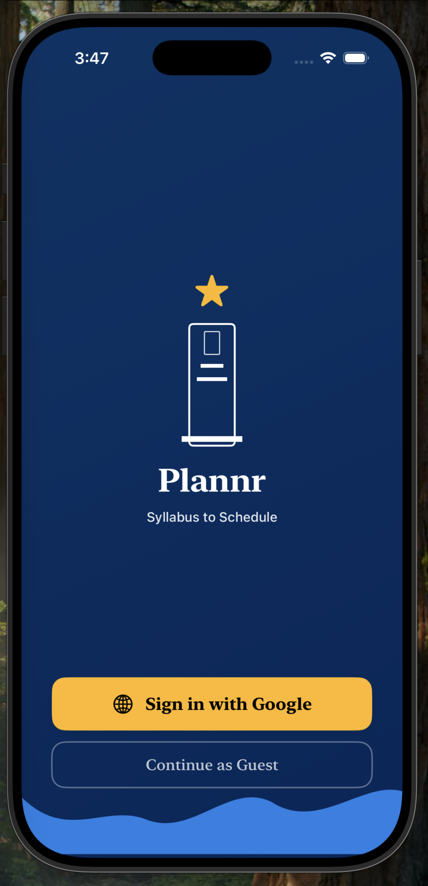
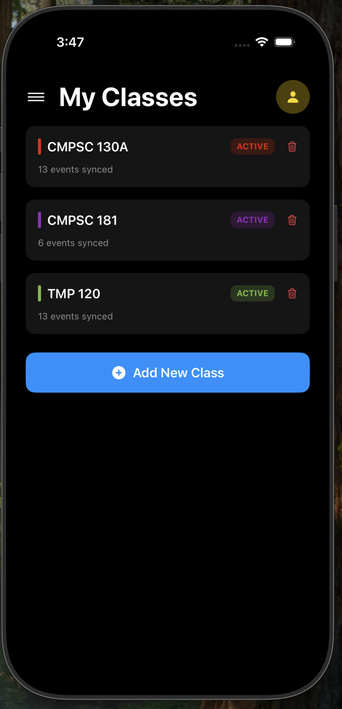
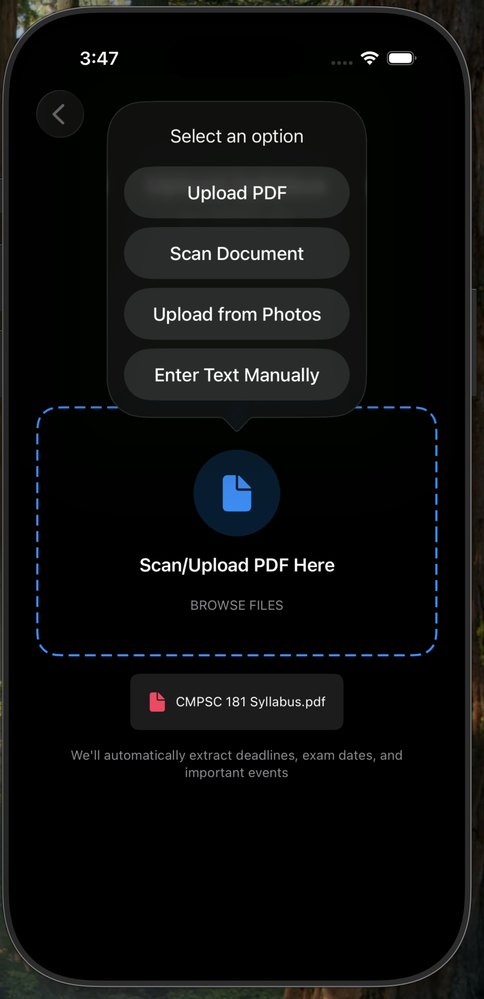
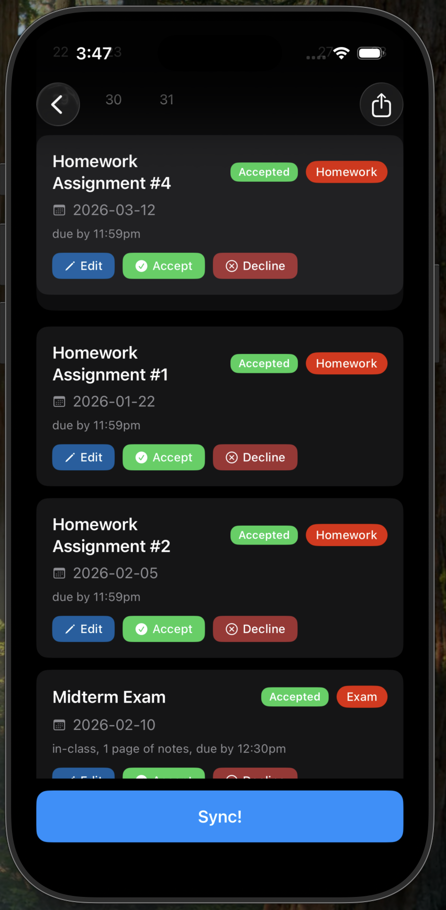
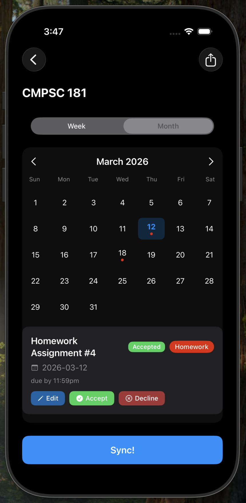
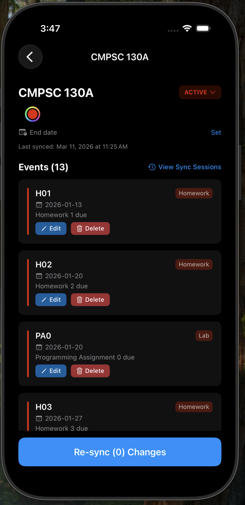
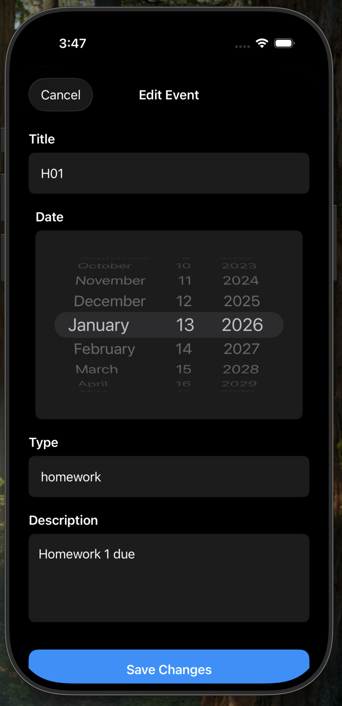
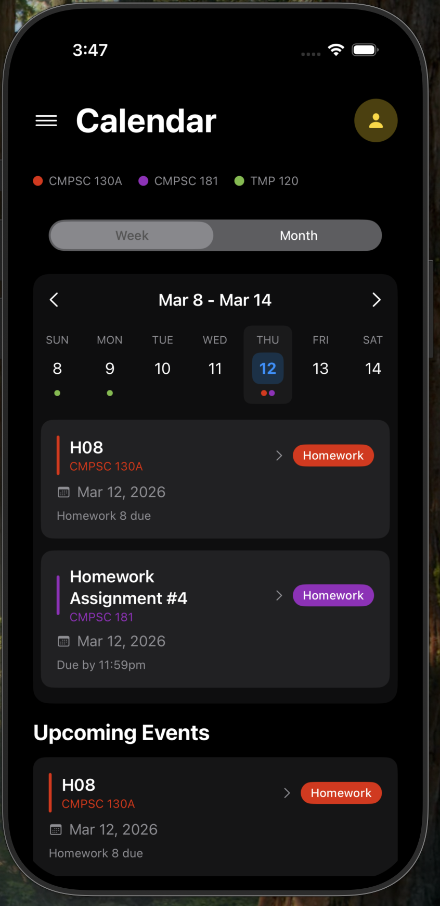
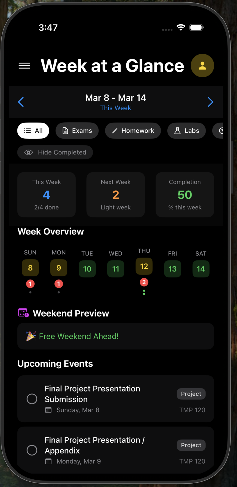
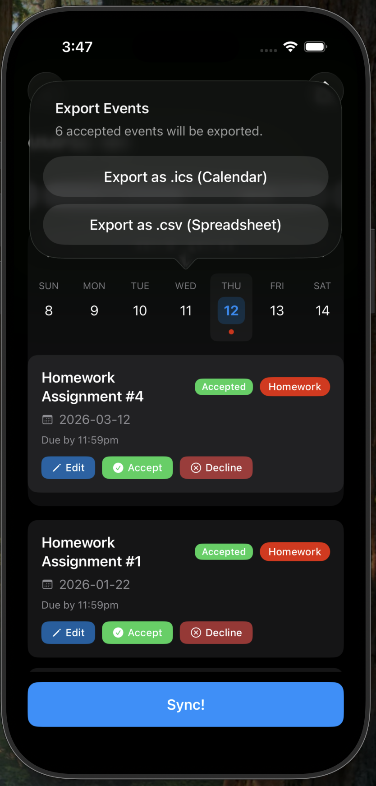

### **Description of Product Purpose**

Managing a course syllabus is one of the first challenges students face at the start of every semester/quarter. Each syllabus is packed with critical dates like assignment deadlines, exam schedules, quiz dates, and project milestones. Manually transferring all of that information into a calendar is time-consuming and prone to human error. A single missed entry can mean a missed deadline.

Plannr solves this problem by automatically parsing uploaded syllabi and converting all relevant dates and events into Google Calendar entries. Using text recognition and Google Gemini, Plannr identifies key academic events within a syllabus document and creates structured, color-coded calendar events. This means no copying, no manual entry, and no guesswork. Students simply upload their syllabus, and Plannr handles the rest, populating their Google Calendar with everything they need to stay on track throughout the semester/quarter.

### **Intended User Audience**

Plannr is designed for college and high school students who are managing the demands of multiple classes simultaneously. At any given time, a typical student may be juggling four to six courses, each with its own syllabus, grading timeline, and schedule of deadlines. Keeping track of it all manually is overwhelming and easy to get wrong.

Plannr is built for students who want to stay organized without spending hours setting up their calendar at the start of each term. Whether a student is trying to plan ahead for a heavy exam week, balance overlapping project deadlines, or simply avoid missing an assignment, Plannr gives them a clear, automated view of their academic schedule from day one. The app is especially valuable for students who are new to managing a heavy course load, though any student looking to focus more on their coursework will benefit.

### **Features**

#### Sign In / Guest Mode

Users can sign in with their Google account to enable full calendar sync and persistent data storage. A Guest Mode is also available for users who want to try the app without signing in; events in guest mode are not saved between sessions.

#### Add Classes

Users can add multiple classes and view their full class list on the home page. Each class can be assigned a custom color for easy visual identification across the calendar.

#### Upload Syllabi

Users can upload their syllabi in four ways: PDF file upload, camera document scanning (with OCR for scanned pages), photo library import, or manual text paste. All methods convert the input into a format ready for AI processing.

#### AI-Powered Event Extraction

Once a syllabus is uploaded, Plannr uses Google Gemini to intelligently parse the document and extract key academic dates. Events are automatically classified by type (homework, exam, quiz, lab, or other) and resolved to specific calendar dates, including relative references like "Week 3 Friday" or "Finals Week."

#### Preview Calendar

Before syncing, users can review all extracted events in a calendar preview. Events can be edited (title, date, time, description) or removed before they are added to Google Calendar.

#### Edit Calendar Events

Users can edit any event after it has been parsed or synced. Changes made locally are preserved when re-uploading an updated syllabus, thanks to automatic event reconciliation.

#### Calendar View

Plannr provides a weekly/monthly grid calendar showing all events from every class, color-coded by class for quick identification. Events can be filtered by type (homework, exam, quiz, lab, or all).

#### Week at a Glance

The Week at a Glance view gives users a focused look at their upcoming week, surfacing all deadlines and events across classes in a single compact view. This makes it easy to anticipate heavy workload periods and plan accordingly.

#### Sync to Google Calendar

Users can push all parsed events to their Google Calendar with one tap. Plannr creates a dedicated secondary calendar for each class with a matching color. Re-syncing handles updates and deletions automatically.

#### Export Events

Events can be exported as an iCal (.ics) file compatible with most calendar apps, or as a CSV spreadsheet for use in other tools.

